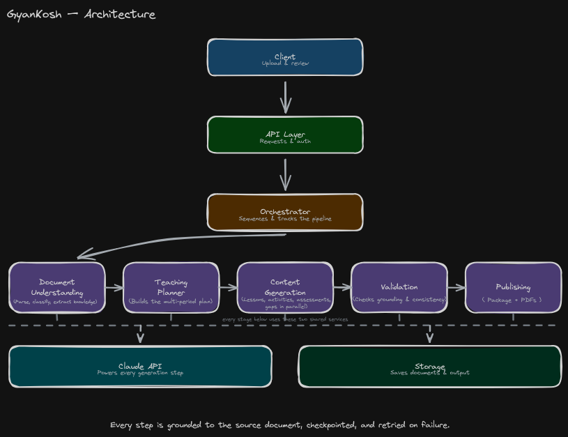

A teacher uploads a document through the client, and the API layer authenticates the request and routes it into the system. The orchestrator picks up the job, sequences the pipeline stage by stage, and tracks its progress as it runs. The pipeline itself parses and classifies the document and extracts its underlying knowledge, then builds a multi period teaching plan from that knowledge. From there it generates lessons, activities, assessments, and a gap analysis in parallel, since none of those depend on each other. The output then goes through validation for grounding and consistency before the final package and its PDFs are published. Claude and the storage layer are used throughout this whole pipeline, not just at one or two steps along the way.

Every step is grounded to the source document, checkpointed, and retried on failure.