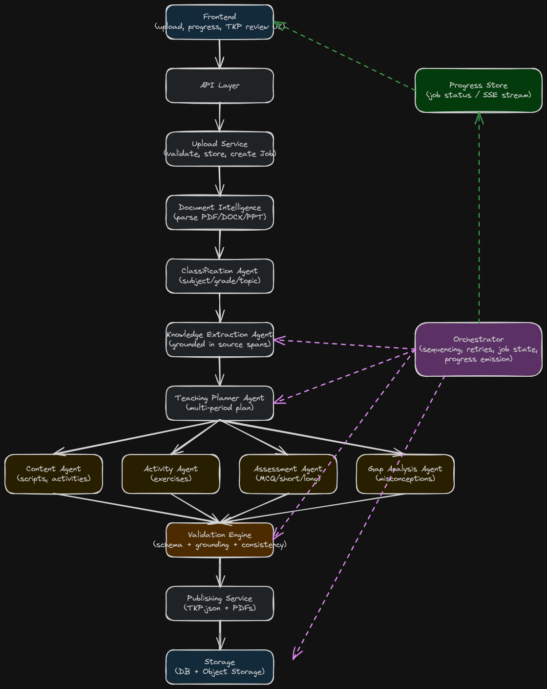

# GyanKosh

**GyanKosh** (Gyan = knowledge, Kosh = treasury) turns a raw educational document into a complete, classroom-ready **Teacher Knowledge Package**: lesson plans, activities, assessments, and a learning-gap analysis, all grounded in your source material and ready to teach from.

Drop in a PDF, DOCX, PPTX, or plain-text chapter. Get back structured JSON and print-ready PDFs, generated by a multi-agent pipeline that cites its sources for every claim it makes.

Live: backend on Render, frontend on Vercel.

---

## Why it's built this way

- **Nothing is hallucinated silently.** Every concept, definition, formula, and assessment question traces back to an exact quote and character offset in your original document. A validation engine independently re-checks this on every run, not just at generation time.
- **It's a team of agents, not one giant prompt.** Eight focused agents (document parsing, classification, extraction, planning, content, activities, assessments, gap analysis) each do one job well and hand off cleanly to the next.
- **It's fast because independent work runs in parallel.** Content, activities, assessments, and gap analysis don't depend on each other, so they generate concurrently instead of one after another.
- **Progress is visible, not a black box.** Watch the pipeline run stage by stage over a live SSE stream, then review, validate, and regenerate individual sections without starting over.

---

## Quick start

**You'll need:** Python 3.11, Node 18+, Postgres, and an Anthropic API key.

```bash
git clone <this-repo>
cd GyanKosh
cp backend/.env.example backend/.env
```

Open `backend/.env` and set `ANTHROPIC_API_KEY`. Every other setting the backend reads lives in [`backend/app/config.py`](../backend/app/config.py), which is the source of truth if you want to see what's configurable.

### Run it with Docker (recommended)

```bash
docker compose up --build
```

That's it. Postgres and the backend start together, and migrations run automatically on boot.

- API: [http://localhost:8000](http://localhost:8000)
- Interactive docs: [http://localhost:8000/docs](http://localhost:8000/docs)
- Health check: [http://localhost:8000/health](http://localhost:8000/health)

### Run it without Docker

```bash
cd backend
python3.11 -m venv .venv && source .venv/bin/activate
pip install -r requirements.txt
alembic upgrade head
uvicorn app.main:app --reload
```

### Start the frontend

```bash
cd frontend
npm install
npm run dev
```

Visit [http://localhost:5173](http://localhost:5173). For a production build, set `VITE_API_BASE_URL` and `VITE_API_KEY` in `frontend/.env` (see `frontend/.env.example`).

No Redis, no separate worker to babysit. The pipeline runs as a background task inside the same web process.

---

## How it works



Full editable diagram: [`architecture-diagram.excalidraw`](architecture-diagram.excalidraw) (open at [excalidraw.com](https://excalidraw.com)).

1. **Upload.** The file is checked for type, size, and real content (not just a trusted file extension), then stored. Re-upload the same document and the cheap early stages are reused instead of re-billed.
2. **Understand the document.** Parses text, tables, figures, and equations, with an OCR fallback for scanned pages.
3. **Classify and extract.** Subject, grade, topic, and difficulty are identified, then every concept, definition, formula, and misconception is pulled out and tagged with its exact source location.
4. **Plan the periods.** The model decides how many class periods the content actually needs and how long each should run, no fixed template.
5. **Generate, in parallel.** Content, activities, assessments, and gap analysis all run at once, each citing the extracted knowledge from step 3.
6. **Validate.** Four independent checks run: schema correctness, source grounding, completeness, and cross-period consistency. The results ship with the package.
7. **Publish.** A `TeacherKnowledgePackage.json` and three PDFs (lesson plans, teacher guide, assessment book) are generated and made available in the review UI.

---

## The orchestration engine

The pipeline is driven by a custom, Postgres-backed orchestrator rather than a general-purpose workflow framework.

- Every stage's output is checkpointed as it completes.
- Failed stages retry automatically with exponential backoff.
- If a stage still fails after retries, or hangs entirely past a timeout, the job fails explicitly with a clear reason. It never just sits there or silently drops work.
- A killed or restarted job resumes from its last checkpoint instead of starting over.

**Why build this instead of adopting Airflow or Temporal?** For a 10-stage pipeline with one real fan-out point, a purpose-built orchestrator is easier to reason about, easier to explain, and has zero extra infrastructure to operate. Depth on something well-tested beats breadth from a dependency the project doesn't need.

**One real architecture pivot along the way:** the original design used Celery and Redis to fan out the four parallel generation stages to a separate worker process. That plan broke against a real constraint: Render's free tier has no background worker option at all. Rather than pay for infrastructure the project's constraints ruled out, or ship a worker that would never run, the pipeline now executes as a background task inside the same web process, with the parallel stages handled by a thread pool instead of a message queue. The orchestrator's actual guarantees (checkpointing, retries, explicit failure) didn't change, only how work gets kicked off.

---

## Built-in highlights

**Multi-agent orchestration**
Eight independently testable agents, each a pure function bound to its own schema:
- Document Intelligence
- Classification
- Knowledge Extraction
- Teaching Planner
- Content Generation
- Activity Generation
- Assessment Generation
- Gap Analysis

**Retrieval-grounded traceability**
Every generated claim cites a literal quote from your source document, matched by exact text, then whitespace-normalized text, then fuzzy matching as a fallback. A dedicated validation check independently re-verifies every citation and will flag a fabricated claim if one ever slips through.

**Real observability**
Every run emits structured logs with a job ID, stage name, and duration, plus a full per-stage timing breakdown available through the API. When something is slow or stuck, you can actually see why.

---

## Samples

Real, unedited pipeline output lives in [`/samples`](../samples):

- **`stem_chemistry_chemical_reactions_and_equations.json`**: a full run against a real NCERT Class 10 Chemistry chapter. Shows formula and equation extraction, a three-period lesson plan, and every validation check passing on genuine STEM content.

More samples (including a humanities example) are on the way.

---

## Testing

**99 automated tests**, run before every push.

- Unit tests per agent, with the LLM mocked and output checked against its schema.
- Golden fixture tests: a STEM document and a humanities document both validate cleanly end to end, and a deliberately thin or messy document degrades gracefully instead of crashing or faking a pass.
- A grounding regression test that deliberately injects a fabricated claim and confirms the validation engine actually catches it.
- Resilience tests that simulate a mid-run crash and confirm the job resumes from its last checkpoint with no duplicate work.
- Broad edge-case coverage: corrupted, empty, oversized, and mistyped uploads, non-English and ambiguous content, runaway period counts, humanities assessments that correctly skip numerical questions, PDF rendering with special characters and long tables, and path traversal attempts against the file-serving route.
- **A live-database concurrency test.** Two real threads open two real transactions against an actual Postgres instance and prove that a row lock genuinely blocks a second concurrent write, measured on the clock of the blocked thread itself. It's the one test in the suite that needs a real database, because that's the only way to prove locking actually works rather than just looking correct.

```bash
cd backend && source .venv/bin/activate
pytest                                                          # 98 tests, no database needed
GYANKOSH_TEST_DATABASE_URL=postgresql+psycopg2://... pytest     # adds the concurrency test
```

---

## Honest limitations

No team ships a system with zero rough edges, and pretending otherwise helps no one. Here's what's genuinely still open:

- **Single-tenant by design.** One worker, one database, one shared API key. This was a deliberate scope decision, not an oversight: there's no multi-tenant or compliance requirement here, and building real user accounts would have been pure scope creep against the deadline.
- **A small coupling between the storage layer and the auth layer.** File-download authorization currently reaches directly into the local storage backend's signature-checking logic instead of going through a fully backend-agnostic interface. Fine today, would need a small refactor if a different storage backend (like S3) were swapped in.
- **Cross-period terminology contradictions aren't explicitly checked.** Validation confirms every period reference is valid and non-duplicated, but doesn't compare the prose of two periods against each other. The actual defense against contradiction is structural: every claim is grounded to one immutable source, so divergence has nowhere to creep in, but this is a design argument, not a dedicated check.
- **Local file storage doesn't survive a redeploy** on the current free-tier hosting. Fine for a demo, not a production storage strategy.
- **Only one sample is published so far,** with a second on the way.
- **Deliberately out of scope:** multilingual generation, curriculum-board alignment (CBSE, Common Core), and a full observability/tracing stack beyond structured logs and stage timing. These were never meant to be built for this version.
